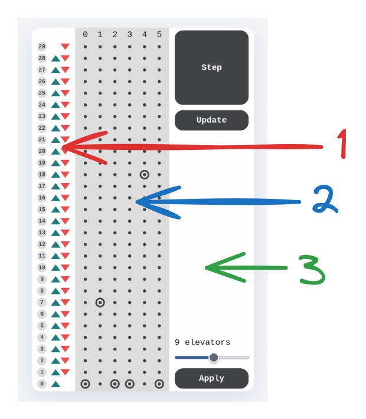
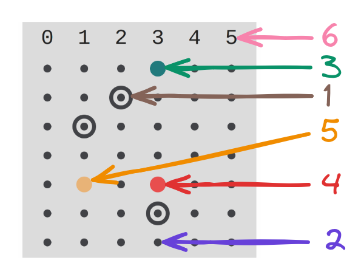
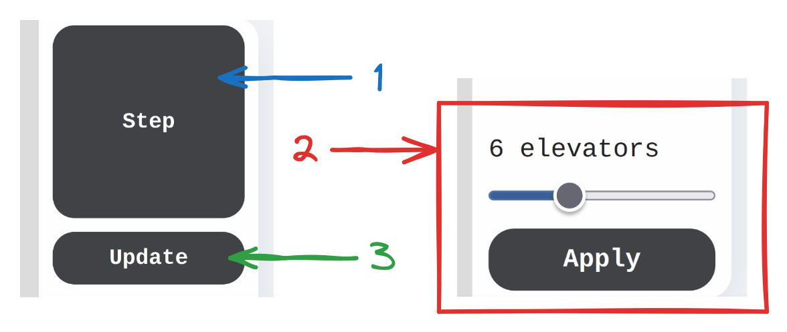

<h1 align="center">
  Elevator System
</h1>

<p align="center">
  <a href="#tech-stack">Tech stack</a> •
  <a href="#overview">Overview</a> •
  <a href="#try">How to run it</a> •
  <a href="#manual">User manual</a> •
  <a href="#app-architecture">Application architecture</a>
</p>

## <a name="tech-stack"></a>:computer: Tech stack

This was built with the help of the following technologies:

| Backend                                                                                                                                                                                                                                                                                                                                                                                                                                                                                                                                                                                                                                                                                                                                                                                        | Frontend                                                                                                                                                                                                                                                                                                                                                                                                                                                                                                                             | CI/CD                                                                                                                          | Additional software                                                                                                                                                                                                                                                                                                                                                                                             |
|------------------------------------------------------------------------------------------------------------------------------------------------------------------------------------------------------------------------------------------------------------------------------------------------------------------------------------------------------------------------------------------------------------------------------------------------------------------------------------------------------------------------------------------------------------------------------------------------------------------------------------------------------------------------------------------------------------------------------------------------------------------------------------------------|--------------------------------------------------------------------------------------------------------------------------------------------------------------------------------------------------------------------------------------------------------------------------------------------------------------------------------------------------------------------------------------------------------------------------------------------------------------------------------------------------------------------------------------|--------------------------------------------------------------------------------------------------------------------------------|-----------------------------------------------------------------------------------------------------------------------------------------------------------------------------------------------------------------------------------------------------------------------------------------------------------------------------------------------------------------------------------------------------------------|
| [](https://openjdk.org/)<br/>[](https://spring.io/) | [](https://react.dev/)<br/>[](https://www.typescriptlang.org/)<br/>[](https://vitejs.dev/) | [](https://www.docker.com/) | [](https://www.jetbrains.com/idea/)<br/>[](https://www.postman.com/)<br/>[](https://www.figma.com/) |

## <a name="overview"></a>:mag_right: Overview

This is an app for managing elevator system consisting of up to
16 elevators and 30 floors.

## <a name="try"></a>:monocle_face: How to run it

> **Note:**
> You need to have [Docker](https://docs.docker.com/engine/install/) installed on your machine.

```bash
# Run docker containers with compose
$ docker-compose up -d --build
```

The UI of application is available at [localhost:3000](http://localhost:3000).<br/>
You can query backend API over [localhost:8000](http://localhost:8000).

## <a name="manual"></a>:closed_book: User manual

The UI can be broken into 3 parts:



1. Control section - responsible for interactions of "Elevator Users"
   with elevator system
1. Visual section - shows current state of all the elevators in the
   system
1. Admin section - controls elevator system "time" and server
   parameters

Let's break down each section:

### Control section

Control section has 2 states: active(on the left) and
inactive(on the right)


1. Cancel button - allows cancelling unfinished elevator call
1. Inactive direction buttons - state in which direction buttons
   appear when elevator was called to arrive at floor **X**. Those
   buttons don't do anything
1. Active direction buttons - set pickup floor and direction
1. Active floor label - shows the floor number and sets destination
   floor
1. Inactive floor label - shows the floor number and does nothing
   on click

### Visual section



1. Elevator point - place where elevator is located
1. Blank point - regular floor with no events
1. Pickup point - place where "Elevator User" is located
1. Inactive destination point - place where "Elevator User" wants to get
   but this user is not in the elevator
1. Active destination point - same as above, but user is inside
   the elevator
1. Elevator id

### Admin section



1. Step button - invokes a step of simulation
1. Elevator amount subsection - allows users to set up simulation
   with up to 16 elevators
1. Update button - allows entering into "Update Mode" which in
   combination with Visual Section allows you to change elevator
   position and its destination

## <a name="app-architecture"></a>:triangular_ruler: Application architecture

### :gear: Algorithmic approach

To make algorithmic explanation easier I will be using graphics with
the following elements.


For the way how elevators will be serving elevator calls and going
to destination I chose SCAN Disk Scheduling algorithm:


But the elevator is not just going from one pickup floor to another,
instead it picks up a so called "Elevator User", who has 3 parameters
such as: pickup floor, destination floor and whether this user has
already been picked up. These "Elevator Users" build up the destinations
arrays of all the Elevators:


*But how those destination arrays are built up? How can "Elevator User" know
which elevator should he wait for?*

This is why I came up with an algorithm which calculates the distance
from the floor where elevator is located to the pickup floor.

This method requires to look through all the possible elevator positions,
relative to their next destination, current direction and pickup floor position
which we are checking against. There are 8 of such possibilities and 1 extra
for stationary elevator.

But thanks to the sign trick that I've noticed I reduced 8 possibilities
to 4 similar case scenarios. Here's the trick explanation:


All the described above business logic is located under
`src/main/java/com/example/elevator/service` directory.

### :herb: Spring application

Spring application contains all the business logic and exposes api
endpoints to all the elevator system functionalities.

### :newspaper: React application

React application doesn't contain any business logic all that it does
is displaying the whole elevator system and all the api
functionalities.